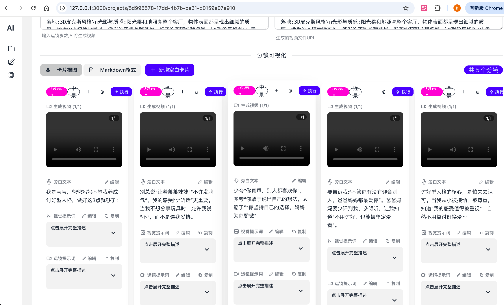
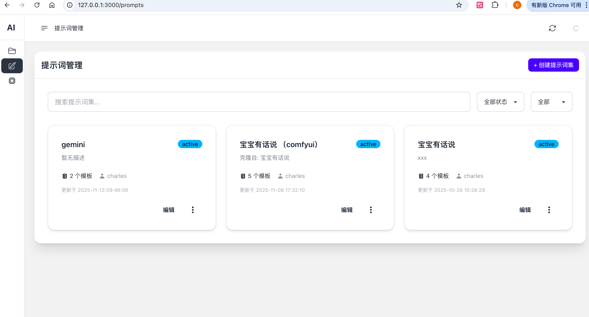
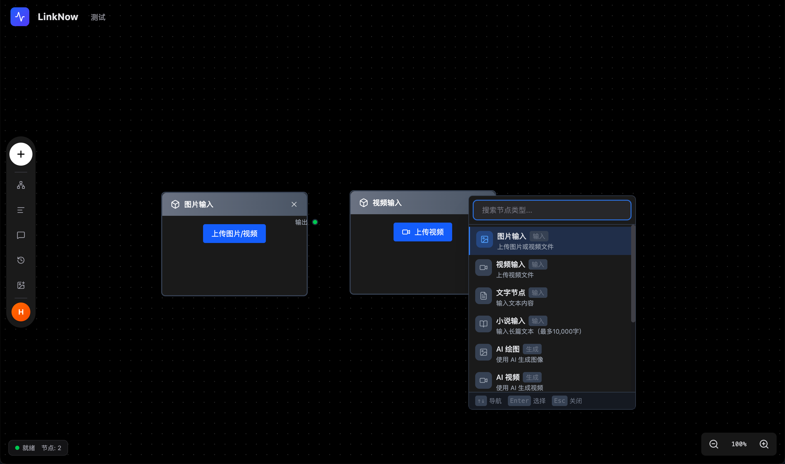

# AI Story - AI驱动的故事视频自动化生成平台

> 🎬 **从文案到视频，一键生成** - 让AI帮你创作专业的故事视频

## 产品简介

AI Story 是一个基于人工智能的故事视频自动化生成平台。只需输入一个故事主题,系统就能自动完成文案创作、分镜设计、图片生成、运镜规划和视频制作的全流程,让视频创作变得简单高效。

---

## 🚀 快速开始

### 使用 Docker Compose 一键启动

```bash
# 启动所有服务
docker-compose up -d

# 初始化数据库
docker-compose exec backend python manage.py migrate

# 创建管理员账号
docker-compose exec backend python manage.py createsuperuser
```

**访问地址:**
- 前端应用: http://localhost:3000
- 后端管理: http://localhost:8000/admin

详细的开发文档请查看 [CLAUDE.md](CLAUDE.md)

---

## 界面预览







**导演模式** - 正在开发中，支持更精细的分镜和视频控制


**成品视频效果** - 视频号搜索：小小方圆669

---

## 核心功能

### 1. 智能文案改写
输入故事主题或大纲，AI自动改写成适合视频呈现的完整脚本。

**特点:**
- 支持多种文案风格（叙事、科普、情感等）
- 自定义提示词模板
- 多个AI模型可选（OpenAI、Claude等）
- 保存历史版本，支持对比

### 2. 自动分镜生成
根据改写后的文案，AI自动拆分场景，生成详细的分镜脚本。

**特点:**
- 智能场景划分
- 自动生成画面描述和旁白
- 为每个分镜生成专业的图片提示词
- 支持手动调整分镜顺序和内容
- 可设置每个镜头的时长

### 3. AI图片生成
基于分镜提示词，自动调用AI绘图服务生成高质量图片。

**特点:**
- 支持多个图片生成平台（Stable Diffusion、DALL-E、Midjourney等）
- 批量生成，实时显示进度
- 失败自动重试
- 图片预览和管理
- 支持修改提示词重新生成

### 4. 智能运镜规划
AI分析每个场景，自动生成合适的镜头运动方案。

**特点:**
- 多种运镜效果（推拉摇移、缩放、静态等）
- 根据场景内容智能匹配运镜类型
- 可自定义运镜参数（速度、强度等）
- 运镜效果预设库

### 5. 图片转视频
将静态图片和运镜参数结合，生成动态视频片段。

**特点:**
- 支持多个视频生成平台（Runway、Pika等）
- 自定义分辨率和帧率
- 批量生成，实时进度追踪
- 视频预览和播放
- 失败自动重试

### 6. 项目管理
完整的项目生命周期管理，让创作井井有条。

**特点:**
- 项目创建、编辑、删除
- 工作流状态实时追踪
- 支持暂停、恢复、重试
- 阶段回滚功能
- 项目导出（视频合成、字幕生成）
- 项目模板保存和复用

### 7. 提示词管理
灵活的提示词系统，让AI更懂你的需求。

**特点:**
- 创建和管理提示词集
- 支持模板变量（如主题、风格、长度等）
- 提示词版本管理
- 效果评估和优化建议
- 提示词测试和预览

### 8. 模型配置
统一管理所有AI服务，灵活切换。

**特点:**
- 支持多个AI服务商
- 每个阶段可配置多个模型
- 负载均衡（轮询、随机、权重、最少负载）
- API连接测试
- 使用量统计和成本分析
- 限流配置

---

## 工作流程

```
输入主题 → 文案改写 → 分镜生成 → 图片生成 → 运镜规划 → 视频生成 → 完成
   ↓          ↓          ↓          ↓          ↓          ↓
 实时进度显示，支持暂停、恢复、重试任意阶段
```

**全程自动化** - 一键启动，自动完成所有步骤
**实时反馈** - WebSocket推送，实时显示生成进度
**灵活控制** - 每个阶段都可以手动调整和重新生成

---

## 技术特点

- **模块化架构** - 基于Pipeline责任链模式，易于扩展
- **异步处理** - Celery任务队列，不阻塞用户操作
- **实时通信** - WebSocket推送，即时反馈进度
- **负载均衡** - 多模型智能调度，提高稳定性
- **容错机制** - 自动重试、故障转移、错误恢复
- **容器化部署** - Docker一键启动，环境隔离

---

## 适用场景

- 📱 **短视频创作** - 快速生成抖音、快手等平台的故事视频
- 📚 **知识科普** - 将文字内容转化为可视化视频
- 🎨 **创意展示** - 艺术创作、概念设计的视频化呈现
- 📖 **儿童故事** - 将童话故事转化为动画视频
- 🎬 **视频原型** - 快速制作视频脚本原型和分镜预览

---

## 开发文档

详细的技术文档和开发指南请查看：
- [开发者指南](CLAUDE.md) - 完整的开发文档和命令参考
- [流式架构文档](backend/CELERY_REDIS_STREAMING.md) - Celery+Redis实时推送架构

---

## 许可证

本项目采用 MIT 许可证。

---

## 联系方式

- 视频号：小小方圆669
- 项目地址：https://github.com/xhongc/ai_story
