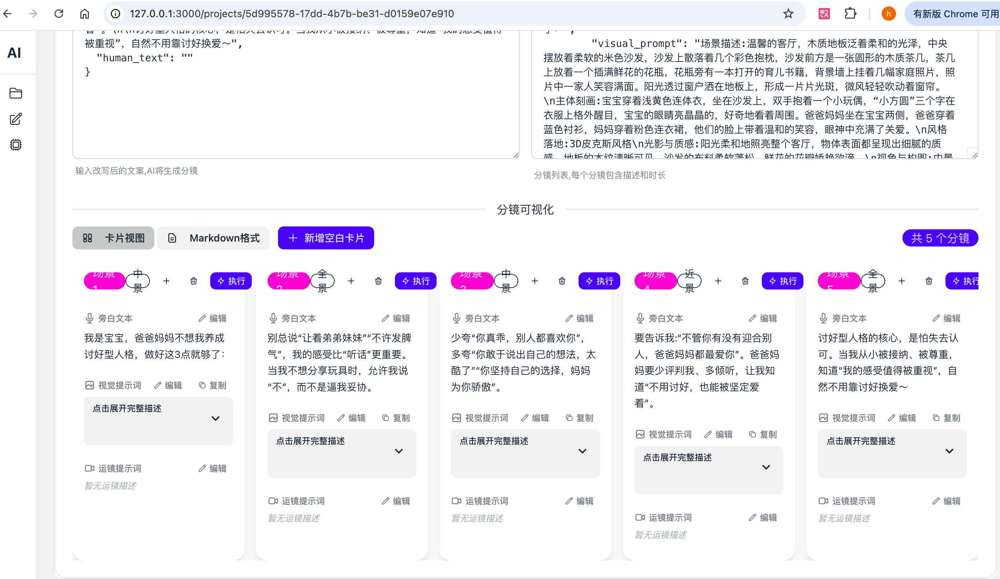

# AI生成故事视频软件

> ✅ **完整框架已搭建** - 后端核心架构 + Vue前端框架已就绪

## 项目状态

✅ **后端框架** - Django + DRF + Celery + Pipeline工作流引擎
✅ **前端框架** - Vue 2 + Vuex + Element UI + Tailwind CSS
⏳ **待实现** - REST API、WebSocket、业务处理器、图片/视频组件

## 🚀 快速开始

### 完整系统启动 (推荐)

```bash
# 使用Docker Compose一键启动所有服务
docker-compose up -d

# 执行后端迁移
docker-compose exec backend python manage.py migrate

# 创建超级用户
docker-compose exec backend python manage.py createsuperuser

# 安装前端依赖(首次需要)
docker-compose exec frontend npm install
```

**访问地址:**
- 前端应用: http://localhost:3000
- 后端API: http://localhost:8000
- Django Admin: http://localhost:8000/admin

### 后端单独启动

```bash
# 1. 进入后端目录
cd backend

# 2. 创建虚拟环境
python -m venv venv
source venv/bin/activate  # Linux/Mac

# 3. 安装依赖
pip install -r requirements/development.txt

# 4. 执行数据库迁移
python manage.py migrate

# 5. 创建超级用户
python manage.py createsuperuser

# 6. 启动开发服务器
python manage.py runserver
```

### 前端单独启动

```bash
# 1. 进入前端目录
cd frontend

# 2. 安装依赖
npm install

# 3. 启动开发服务器
npm run dev
```

访问: http://localhost:3000

## 📚 详细文档

- [后端开发文档](backend/README.md)
- [前端开发文档](frontend/README.md)
- [前端框架报告](FRONTEND_REPORT.md)
- [架构设计文档](ARCHITECTURE.md)
- [框架总览](FRAMEWORK_SUMMARY.md)
- [项目报告](PROJECT_REPORT.md)

---

## 目录
- [技术架构](#技术架构)
- [业务功能流程](#业务功能流程)
- [系统架构设计](#系统架构设计)
- [核心领域模型](#核心领域模型)
- [工作流设计](#工作流设计)
- [项目结构](#项目结构)
- [API 设计](#api-设计)
- [数据库设计](#数据库设计)
- [前端架构](#前端架构)
- [实施计划](#实施计划)

---

# 技术架构

## 后端技术栈
- **Django 3.2.15** (Python 3.11+)
- **Django REST Framework** - RESTful API 开发
- **Celery + Redis** - 异步任务队列和缓存
- **SQLite** - 主数据库
- **Channels** - WebSocket 实时通信

## 前端技术栈
- **Vue 2** + Vue Router + Vuex
- **Tailwind CSS** + **DaisyUI**
- **Axios** - HTTP 客户端
- **WebSocket** - 实时状态更新

## 基础设施
- **Docker + Docker Compose** - 容器化部署
- **Nginx** - 反向代理和静态文件服务

---
# 界面截图

# 业务功能流程





## 1. 文案改写
**功能描述：** 用户输入文案大体主题，执行大模型进行文案改写流程

**技术实现：**
- 支持自定义提示词模板
- 调用 OpenAI 兼容的 LLM API
- 支持多模型负载均衡
- 保存改写历史和版本对比

## 2. 分镜输出
**功能描述：** 将文案改写后的内容，执行大模型进行分镜输出流程

**技术实现：**
- 提示词可配置
- 生成文生图提示词 (Image Prompt)
- 输出结构化分镜数据 (序号、场景描述、旁白、时长)
- 支持手动调整分镜顺序和内容

## 3. 文生图 (Text-to-Image)
**功能描述：** 调用 API 生成图片

**功能特性：**
- 图片管理 (浏览、修改提示词、删除)
- 失败重试机制
- 批量生成和进度追踪
- 图片预览和缩略图
- 支持多个文生图 API (Stable Diffusion, DALL-E, Midjourney 等)

## 4. 运镜生成 (Camera Movement)
**功能描述：** 将分段的文案输入大模型，执行大模型进行运镜生成流程

**技术实现：**
- 提示词可配置
- 生成运镜参数 (zoom_in, pan_left, tilt_up, static 等)
- 与分镜一一对应
- 支持运镜效果预设库

## 5. 图生视频 (Image-to-Video)
**功能描述：** 根据运镜生成的每个运镜和文生图的图片一一对应，生成视频

**功能特性：**
- 视频管理 (播放、重新生成、删除)
- 失败重试机制
- 生成进度实时显示
- 支持多分辨率和时长配置
- 支持多个图生视频 API (Runway, Pika, 等)

## 6. 项目管理
**功能描述：** 每个故事是一个项目，包含完整的工作流

**核心功能：**
- 项目创建、编辑、删除
- 工作流状态追踪 (文案改写 → 分镜 → 文生图 → 运镜 → 图生视频)
- 阶段重试和回滚
- 项目导出 (视频合成、字幕生成)
- 项目模板保存

## 7. 提示词管理
**功能描述：** 创建和管理提示词集

**核心功能：**
- 提示词集 CRUD
- 支持模板变量 (如 `{topic}`, `{style}`)
- 版本管理
- 与项目关联
- 提示词效果评估和优化建议

## 8. 模型管理
**功能描述：** 管理各类 AI 模型 API 配置

**配置项：**
- **LLM 模型：** API URL, API Key, 模型名称, 温度, 最大 Token
- **文生图模型：** API URL, API Key, 默认参数 (尺寸、步数等)
- **图生视频模型：** API URL, API Key, 分辨率、时长配置


---

# 系统架构设计

## 设计原则
本项目严格遵循以下软件工程原则：

1. **SOLID 原则**
   - **单一职责 (SRP)：** 每个类/模块只负责一项功能
   - **开闭原则 (OCP)：** 对扩展开放，对修改封闭
   - **里氏替换 (LSP)：** 子类可替换父类
   - **接口隔离 (ISP)：** 接口专一，避免胖接口
   - **依赖倒置 (DIP)：** 依赖抽象而非具体实现

2. **KISS (Keep It Simple, Stupid)：** 追求简洁，避免过度设计
3. **DRY (Don't Repeat Yourself)：** 杜绝重复代码
4. **YAGNI (You Aren't Gonna Need It)：** 只实现当前需要的功能

## 分层架构

```
┌─────────────────────────────────────────────┐
│          前端层 (Vue 2 + Vuex)               │
│  - 用户界面                                   │
│  - 状态管理                                   │
│  - WebSocket 实时更新                         │
└─────────────────────────────────────────────┘
                      ↓ HTTP/WS
┌─────────────────────────────────────────────┐
│       API 层 (Django REST Framework)         │
│  - RESTful 端点                              │
│  - 认证和权限                                 │
│  - 请求验证和序列化                           │
└─────────────────────────────────────────────┘
                      ↓
┌─────────────────────────────────────────────┐
│         业务逻辑层 (Service Layer)            │
│  - ProjectService                            │
│  - PipelineOrchestrator                      │
│  - AIClientManager                           │
│  - LoadBalancer                              │
└─────────────────────────────────────────────┘
                      ↓
┌─────────────────────────────────────────────┐
│         领域模型层 (Domain Models)            │
│  - Project, Storyboard                       │
│  - PromptTemplate, ModelProvider             │
│  - GeneratedImage, GeneratedVideo            │
└─────────────────────────────────────────────┘
                      ↓
┌─────────────────────────────────────────────┐
│      基础设施层 (Infrastructure)              │
│  - sqlite (数据持久化)                    │
│  - Redis (缓存 + 任务队列)                    │
│  - MinIO/OSS (对象存储)                       │
│  - Celery (异步任务)                          │
└─────────────────────────────────────────────┘
                      ↓
┌─────────────────────────────────────────────┐
│         外部服务层 (External Services)        │
│  - OpenAI/Claude API                         │
│  - Stable Diffusion API                      │
│  - Runway/Pika API                           │
└─────────────────────────────────────────────┘
```

---

# 核心领域模型

## 1. 项目管理域

### Project (项目)
```python
class Project(models.Model):
    id = models.UUIDField(primary_key=True, default=uuid.uuid4)
    name = models.CharField(max_length=255)
    description = models.TextField(blank=True)

    # 业务字段
    original_topic = models.TextField()  # 原始主题
    status = models.CharField(max_length=20, choices=STATUS_CHOICES)
    # 状态: draft, processing, completed, failed, paused

    # 关联配置
    prompt_template_set = models.ForeignKey('PromptTemplateSet')
    model_config = models.ForeignKey('ProjectModelConfig')

    # 所有者
    user = models.ForeignKey(User)

    # 时间戳
    created_at = models.DateTimeField(auto_now_add=True)
    updated_at = models.DateTimeField(auto_now=True)
    completed_at = models.DateTimeField(null=True)
```

### ProjectStage (项目阶段记录)
```python
class ProjectStage(models.Model):
    """使用状态机模式管理阶段状态"""

    project = models.ForeignKey(Project)
    stage_type = models.CharField(max_length=20, choices=STAGE_TYPES)
    # 类型: rewrite, storyboard, image_generation,
    #      camera_movement, video_generation

    status = FSMField(default='pending')
    # 状态: pending, processing, completed, failed

    input_data = models.JSONField()   # 输入数据
    output_data = models.JSONField()  # 输出数据

    retry_count = models.IntegerField(default=0)
    max_retries = models.IntegerField(default=3)
    error_message = models.TextField(blank=True)

    started_at = models.DateTimeField(null=True)
    completed_at = models.DateTimeField(null=True)
```

## 2. 提示词管理域

### PromptTemplateSet (提示词集)
```python
class PromptTemplateSet(models.Model):
    name = models.CharField(max_length=255)
    description = models.TextField(blank=True)
    is_active = models.BooleanField(default=True)
    is_default = models.BooleanField(default=False)

    created_by = models.ForeignKey(User)
    created_at = models.DateTimeField(auto_now_add=True)
    updated_at = models.DateTimeField(auto_now=True)
```

### PromptTemplate (提示词模板)
```python
class PromptTemplate(models.Model):
    template_set = models.ForeignKey(PromptTemplateSet, related_name='templates')
    stage_type = models.CharField(max_length=20, choices=STAGE_TYPES)

    # 模板内容 (支持 Jinja2 语法)
    template_content = models.TextField()
    # 示例: "请将以下主题改写为故事脚本：{topic}\n风格：{style}"

    # 变量定义
    variables = models.JSONField(default=dict)
    # 示例: {"topic": "string", "style": "string", "length": "int"}

    version = models.IntegerField(default=1)
    is_active = models.BooleanField(default=True)
```

## 3. 模型管理域

### ModelProvider (模型提供商)
```python
class ModelProvider(models.Model):
    name = models.CharField(max_length=255)
    provider_type = models.CharField(max_length=20, choices=PROVIDER_TYPES)
    # 类型: llm, text2image, image2video

    # API 配置
    api_url = models.URLField()
    api_key = EncryptedCharField(max_length=512)  # 加密存储
    model_name = models.CharField(max_length=255)

    # LLM 专用参数
    max_tokens = models.IntegerField(default=2000)
    temperature = models.FloatField(default=0.7)
    top_p = models.FloatField(default=1.0)

    # 通用参数
    timeout = models.IntegerField(default=60)  # 秒
    is_active = models.BooleanField(default=True)
    priority = models.IntegerField(default=0)  # 负载均衡权重

    # 限流配置
    rate_limit_rpm = models.IntegerField(default=60)  # 每分钟请求数
    rate_limit_rpd = models.IntegerField(default=1000)  # 每天请求数

    created_at = models.DateTimeField(auto_now_add=True)
```

### ProjectModelConfig (项目模型配置)
```python
class ProjectModelConfig(models.Model):
    """项目的模型配置 - 支持每个阶段配置多个模型"""

    project = models.OneToOneField(Project)

    # 多对多关系：每个阶段可以配置多个模型
    rewrite_providers = models.ManyToManyField(
        ModelProvider,
        related_name='rewrite_configs',
        limit_choices_to={'provider_type': 'llm'}
    )
    storyboard_providers = models.ManyToManyField(ModelProvider)
    image_providers = models.ManyToManyField(ModelProvider)
    camera_providers = models.ManyToManyField(ModelProvider)
    video_providers = models.ManyToManyField(ModelProvider)

    # 负载均衡策略
    load_balance_strategy = models.CharField(
        max_length=20,
        choices=[
            ('round_robin', '轮询'),
            ('random', '随机'),
            ('weighted', '权重随机'),
            ('least_loaded', '最少负载')
        ],
        default='weighted'
    )
```

## 4. 内容生成域

### ContentRewrite (文案改写)
```python
class ContentRewrite(models.Model):
    project = models.OneToOneField(Project)
    original_text = models.TextField()
    rewritten_text = models.TextField()

    model_provider = models.ForeignKey(ModelProvider)
    prompt_used = models.TextField()  # 记录使用的提示词

    generation_metadata = models.JSONField()
    # 元数据: {tokens_used, latency_ms, model_version, ...}

    created_at = models.DateTimeField(auto_now_add=True)
```

### Storyboard (分镜)
```python
class Storyboard(models.Model):
    project = models.ForeignKey(Project, related_name='storyboards')
    sequence_number = models.IntegerField()  # 分镜序号

    scene_description = models.TextField()  # 场景描述
    narration_text = models.TextField()     # 旁白文案
    image_prompt = models.TextField()       # 文生图提示词

    duration_seconds = models.FloatField(default=3.0)

    created_at = models.DateTimeField(auto_now_add=True)

    class Meta:
        unique_together = ('project', 'sequence_number')
        ordering = ['sequence_number']
```

### GeneratedImage (生成图片)
```python
class GeneratedImage(models.Model):
    storyboard = models.ForeignKey(Storyboard, related_name='images')

    image_url = models.URLField()
    thumbnail_url = models.URLField()

    # 生成参数
    generation_params = models.JSONField()
    # 参数: {prompt, negative_prompt, steps, cfg_scale, seed, ...}

    model_provider = models.ForeignKey(ModelProvider)
    status = models.CharField(max_length=20, choices=STATUS_CHOICES)
    retry_count = models.IntegerField(default=0)

    # 文件信息
    file_size = models.BigIntegerField()  # 字节
    width = models.IntegerField()
    height = models.IntegerField()

    created_at = models.DateTimeField(auto_now_add=True)
```

### CameraMovement (运镜)
```python
class CameraMovement(models.Model):
    storyboard = models.OneToOneField(Storyboard)

    movement_type = models.CharField(max_length=50, choices=MOVEMENT_TYPES)
    # 类型: static, zoom_in, zoom_out, pan_left, pan_right,
    #      tilt_up, tilt_down, dolly_in, dolly_out, etc.

    movement_params = models.JSONField()
    # 参数: {speed, intensity, easing, start_frame, end_frame}

    model_provider = models.ForeignKey(ModelProvider)
    prompt_used = models.TextField()

    created_at = models.DateTimeField(auto_now_add=True)
```

### GeneratedVideo (生成视频)
```python
class GeneratedVideo(models.Model):
    storyboard = models.ForeignKey(Storyboard, related_name='videos')
    image = models.ForeignKey(GeneratedImage)
    camera_movement = models.ForeignKey(CameraMovement)

    video_url = models.URLField()
    thumbnail_url = models.URLField()

    # 视频属性
    duration = models.FloatField()  # 秒
    width = models.IntegerField()
    height = models.IntegerField()
    fps = models.IntegerField(default=24)
    file_size = models.BigIntegerField()

    model_provider = models.ForeignKey(ModelProvider)
    generation_params = models.JSONField()

    status = models.CharField(max_length=20, choices=STATUS_CHOICES)
    retry_count = models.IntegerField(default=0)

    created_at = models.DateTimeField(auto_now_add=True)
```

---

# 工作流设计

## Pipeline 架构 (责任链 + 策略模式)

### 核心抽象

```python
# core/pipeline/base.py
from abc import ABC, abstractmethod

class PipelineContext:
    """工作流上下文 - 携带所有阶段的数据"""

    def __init__(self, project_id: str):
        self.project_id = project_id
        self.results = {}
        self.metadata = {}

    def add_result(self, stage: str, data: dict):
        self.results[stage] = data

    def get_result(self, stage: str):
        return self.results.get(stage)


class StageProcessor(ABC):
    """阶段处理器抽象基类 - 单一职责原则"""

    @abstractmethod
    async def validate(self, context: PipelineContext) -> bool:
        """验证阶段是否可以执行"""
        pass

    @abstractmethod
    async def process(self, context: PipelineContext) -> StageResult:
        """执行阶段处理"""
        pass

    @abstractmethod
    async def on_failure(self, context: PipelineContext, error: Exception):
        """失败处理"""
        pass


class StageResult:
    """阶段执行结果"""

    def __init__(self, success: bool, data: dict = None,
                 error: str = None, can_retry: bool = True):
        self.success = success
        self.data = data or {}
        self.error = error
        self.can_retry = can_retry
```

### 具体处理器实现

```python
# apps/content/processors/rewrite.py
class RewriteProcessor(StageProcessor):
    """文案改写处理器"""

    def __init__(self, model_manager, prompt_manager):
        self.model_manager = model_manager
        self.prompt_manager = prompt_manager

    async def validate(self, context: PipelineContext) -> bool:
        project = await Project.objects.aget(id=context.project_id)
        return bool(project.original_topic)

    async def process(self, context: PipelineContext) -> StageResult:
        try:
            project = await Project.objects.aget(id=context.project_id)

            # 1. 获取提示词模板
            prompt = await self.prompt_manager.render_template(
                stage_type='rewrite',
                variables={'topic': project.original_topic}
            )

            # 2. 调用 LLM (支持负载均衡)
            provider = await self.model_manager.select_provider(
                stage_type='rewrite',
                project=project
            )

            response = await provider.generate(
                prompt=prompt,
                max_tokens=2000
            )

            # 3. 保存结果
            rewrite = await ContentRewrite.objects.acreate(
                project=project,
                original_text=project.original_topic,
                rewritten_text=response.text,
                model_provider=provider,
                prompt_used=prompt,
                generation_metadata=response.metadata
            )

            # 4. 更新项目状态
            await ProjectStage.objects.filter(
                project=project,
                stage_type='rewrite'
            ).aupdate(
                status='completed',
                output_data={'rewrite_id': rewrite.id}
            )

            return StageResult(
                success=True,
                data={'rewritten_text': response.text}
            )

        except Exception as e:
            await self.on_failure(context, e)
            return StageResult(
                success=False,
                error=str(e),
                can_retry=True
            )

    async def on_failure(self, context: PipelineContext, error: Exception):
        await ProjectStage.objects.filter(
            project_id=context.project_id,
            stage_type='rewrite'
        ).aupdate(
            status='failed',
            error_message=str(error)
        )
```

### Pipeline 编排器

```python
# core/pipeline/orchestrator.py
class ProjectPipeline:
    """项目工作流编排器"""

    def __init__(self):
        self.stages = [
            RewriteProcessor(),
            StoryboardProcessor(),
            ImageGenerationProcessor(),
            CameraMovementProcessor(),
            VideoGenerationProcessor()
        ]

    async def execute(self, project_id: str):
        """执行完整的项目工作流"""

        context = PipelineContext(project_id)

        for stage in self.stages:
            # 验证阶段
            if not await stage.validate(context):
                raise ValidationError(f"Stage {stage.__class__.__name__} validation failed")

            # 执行阶段
            result = await stage.process(context)
            context.add_result(stage.__class__.__name__, result.data)

            # 处理失败
            if not result.success:
                if result.can_retry:
                    # 重试逻辑
                    result = await self._retry_stage(stage, context)

                if not result.success:
                    break  # 停止工作流

        return context

    async def _retry_stage(self, stage: StageProcessor,
                          context: PipelineContext, max_retries: int = 3):
        """重试逻辑 - 指数退避"""

        for attempt in range(max_retries):
            await asyncio.sleep(2 ** attempt)  # 1s, 2s, 4s

            result = await stage.process(context)
            if result.success:
                return result

        return result
```

---

# 项目结构

```
ai_story/
├── backend/                       # Django 后端
│   ├── config/                    # 项目配置
│   │   ├── settings/
│   │   │   ├── base.py
│   │   │   ├── development.py
│   │   │   └── production.py
│   │   ├── urls.py
│   │   ├── asgi.py                # WebSocket 配置
│   │   └── celery.py              # Celery 配置
│   │
│   ├── apps/                      # 应用模块
│   │   ├── projects/              # 项目管理
│   │   │   ├── models.py
│   │   │   ├── serializers.py
│   │   │   ├── views.py
│   │   │   ├── services.py        # 业务逻辑层
│   │   │   ├── tasks.py           # Celery 任务
│   │   │   └── tests/
│   │   │
│   │   ├── prompts/               # 提示词管理
│   │   │   ├── models.py
│   │   │   ├── serializers.py
│   │   │   ├── views.py
│   │   │   └── template_engine.py # 模板渲染引擎
│   │   │
│   │   ├── models/                # 模型管理
│   │   │   ├── models.py
│   │   │   ├── serializers.py
│   │   │   ├── views.py
│   │   │   └── load_balancer.py   # 负载均衡器
│   │   │
│   │   ├── content/               # 内容生成
│   │   │   ├── models.py
│   │   │   ├── serializers.py
│   │   │   ├── views.py
│   │   │   ├── processors/        # 阶段处理器
│   │   │   │   ├── rewrite.py
│   │   │   │   ├── storyboard.py
│   │   │   │   ├── image.py
│   │   │   │   ├── camera.py
│   │   │   │   └── video.py
│   │   │   └── tasks.py
│   │   │
│   │   └── users/                 # 用户认证
│   │       ├── models.py
│   │       ├── serializers.py
│   │       └── views.py
│   │
│   ├── core/                      # 核心抽象和工具
│   │   ├── ai_client/             # AI 客户端抽象
│   │   │   ├── base.py            # 抽象基类
│   │   │   ├── openai_client.py
│   │   │   ├── text2image_client.py
│   │   │   └── image2video_client.py
│   │   │
│   │   ├── pipeline/              # 工作流引擎
│   │   │   ├── base.py
│   │   │   └── orchestrator.py
│   │   │
│   │   ├── storage/               # 存储抽象
│   │   │   ├── base.py
│   │   │   ├── minio_backend.py
│   │   │   └── oss_backend.py
│   │   │
│   │   ├── retry_handler.py       # 重试机制
│   │   ├── rate_limiter.py        # 限流器
│   │   └── encryption.py          # 加密工具
│   │
│   ├── utils/                     # 通用工具
│   │   ├── exceptions.py
│   │   ├── validators.py
│   │   └── helpers.py
│   │
│   ├── manage.py
│   └── requirements/
│       ├── base.txt
│       ├── development.txt
│       └── production.txt
│
├── frontend/                      # Vue 前端
│   ├── public/
│   ├── src/
│   │   ├── main.js
│   │   ├── App.vue
│   │   │
│   │   ├── views/                 # 页面组件
│   │   │   ├── ProjectList.vue
│   │   │   ├── ProjectDetail.vue
│   │   │   ├── ProjectWorkspace.vue
│   │   │   ├── PromptManage.vue
│   │   │   └── ModelManage.vue
│   │   │
│   │   ├── components/            # 复用组件
│   │   │   ├── atoms/             # 原子组件
│   │   │   │   ├── Button.vue
│   │   │   │   ├── Input.vue
│   │   │   │   └── StatusBadge.vue
│   │   │   ├── molecules/         # 分子组件
│   │   │   │   ├── ImageCard.vue
│   │   │   │   ├── VideoCard.vue
│   │   │   │   └── StageProgress.vue
│   │   │   └── organisms/         # 有机组件
│   │   │       ├── StoryboardList.vue
│   │   │       ├── PipelineFlow.vue
│   │   │       └── ImageGallery.vue
│   │   │
│   │   ├── store/                 # Vuex 状态管理
│   │   │   ├── index.js
│   │   │   └── modules/
│   │   │       ├── project.js
│   │   │       ├── prompt.js
│   │   │       └── model.js
│   │   │
│   │   ├── router/                # 路由配置
│   │   │   └── index.js
│   │   │
│   │   ├── api/                   # API 封装
│   │   │   ├── axios.js
│   │   │   ├── project.js
│   │   │   ├── prompt.js
│   │   │   └── model.js
│   │   │
│   │   ├── utils/                 # 工具函数
│   │   │   ├── websocket.js
│   │   │   └── helpers.js
│   │   │
│   │   └── assets/                # 静态资源
│   │       ├── styles/
│   │       └── images/
│   │
│   ├── package.json
│   ├── tailwind.config.js
│   └── vue.config.js
│
├── docker/                        # Docker 配置
│   ├── backend.Dockerfile
│   ├── frontend.Dockerfile
│   └── nginx.conf
│
├── docker-compose.yml
├── .gitignore
├── .env.example
└── README.md
```

---

# API 设计

## RESTful 端点规范

### 项目管理 API

```
# 项目 CRUD
GET     /api/v1/projects/                    # 获取项目列表
POST    /api/v1/projects/                    # 创建项目
GET     /api/v1/projects/{id}/               # 获取项目详情
PATCH   /api/v1/projects/{id}/               # 更新项目
DELETE  /api/v1/projects/{id}/               # 删除项目

# 项目工作流
POST    /api/v1/projects/{id}/execute/       # 执行完整工作流
POST    /api/v1/projects/{id}/pause/         # 暂停执行
POST    /api/v1/projects/{id}/resume/        # 恢复执行
GET     /api/v1/projects/{id}/status/        # 获取执行状态

# 阶段管理
GET     /api/v1/projects/{id}/stages/        # 获取所有阶段状态
POST    /api/v1/projects/{id}/stages/{stage}/retry/  # 重试某阶段
POST    /api/v1/projects/{id}/stages/{stage}/skip/   # 跳过某阶段
```

### 内容生成 API

```
# 文案改写
POST    /api/v1/content/rewrite/             # 执行文案改写
GET     /api/v1/content/rewrite/{id}/        # 获取改写结果

# 分镜管理
GET     /api/v1/storyboards/?project_id=     # 获取分镜列表
POST    /api/v1/storyboards/                 # 创建分镜
PATCH   /api/v1/storyboards/{id}/            # 更新分镜
DELETE  /api/v1/storyboards/{id}/            # 删除分镜
POST    /api/v1/storyboards/{id}/reorder/    # 调整顺序

# 图片管理
GET     /api/v1/images/?storyboard_id=       # 获取图片列表
POST    /api/v1/images/                      # 生成图片
PATCH   /api/v1/images/{id}/                 # 修改图片提示词
DELETE  /api/v1/images/{id}/                 # 删除图片
POST    /api/v1/images/{id}/regenerate/      # 重新生成

# 运镜管理
GET     /api/v1/camera-movements/{id}/       # 获取运镜详情
PATCH   /api/v1/camera-movements/{id}/       # 修改运镜参数
POST    /api/v1/camera-movements/{id}/regenerate/  # 重新生成

# 视频管理
GET     /api/v1/videos/?storyboard_id=       # 获取视频列表
POST    /api/v1/videos/                      # 生成视频
DELETE  /api/v1/videos/{id}/                 # 删除视频
POST    /api/v1/videos/{id}/regenerate/      # 重新生成
```

### 提示词管理 API

```
# 提示词集
GET     /api/v1/prompts/sets/                # 获取提示词集列表
POST    /api/v1/prompts/sets/                # 创建提示词集
GET     /api/v1/prompts/sets/{id}/           # 获取详情
PATCH   /api/v1/prompts/sets/{id}/           # 更新提示词集
DELETE  /api/v1/prompts/sets/{id}/           # 删除提示词集

# 提示词模板
GET     /api/v1/prompts/templates/?set_id=   # 获取模板列表
POST    /api/v1/prompts/templates/           # 创建模板
PATCH   /api/v1/prompts/templates/{id}/      # 更新模板
DELETE  /api/v1/prompts/templates/{id}/      # 删除模板
POST    /api/v1/prompts/templates/{id}/test/ # 测试模板渲染
```

### 模型管理 API

```
# 模型提供商
GET     /api/v1/models/providers/            # 获取模型列表
POST    /api/v1/models/providers/            # 添加模型
GET     /api/v1/models/providers/{id}/       # 获取详情
PATCH   /api/v1/models/providers/{id}/       # 更新模型配置
DELETE  /api/v1/models/providers/{id}/       # 删除模型
POST    /api/v1/models/providers/{id}/test/  # 测试连接

# 模型统计
GET     /api/v1/models/providers/{id}/usage/ # 使用量统计
GET     /api/v1/models/providers/{id}/cost/  # 成本统计
```

### WebSocket 端点

```
ws://api.example.com/ws/projects/{project_id}/

# 消息格式
{
    "type": "stage_update",
    "data": {
        "stage": "image_generation",
        "status": "processing",
        "progress": 0.6,
        "message": "Generating image 3/5..."
    }
}
```

---

# 数据库设计

## 核心表结构

### 索引策略

```sql
-- 项目查询优化
CREATE INDEX idx_project_user_status
ON projects(user_id, status, created_at DESC);

-- 分镜序列查询
CREATE INDEX idx_storyboard_project_sequence
ON storyboards(project_id, sequence_number);

-- 图片查询优化
CREATE INDEX idx_image_storyboard_status
ON generated_images(storyboard_id, status);

-- 视频查询优化
CREATE INDEX idx_video_storyboard_status
ON generated_videos(storyboard_id, status);

-- 模型负载均衡
CREATE INDEX idx_model_provider_type_active
ON model_providers(provider_type, is_active, priority DESC);

-- 提示词查询
CREATE INDEX idx_prompt_template_set_stage
ON prompt_templates(template_set_id, stage_type, is_active);
```

### 外键约束

```sql
-- 项目关联
ALTER TABLE projects
ADD CONSTRAINT fk_project_prompt_set
FOREIGN KEY (prompt_template_set_id)
REFERENCES prompt_template_sets(id) ON DELETE SET NULL;

-- 分���关联
ALTER TABLE storyboards
ADD CONSTRAINT fk_storyboard_project
FOREIGN KEY (project_id)
REFERENCES projects(id) ON DELETE CASCADE;

-- 级联删除策略
-- 删除项目时自动删除所有相关数据
```

### 数据库视图 (性能优化)

```sql
-- 项目概览视图
CREATE VIEW project_overview AS
SELECT
    p.id,
    p.name,
    p.status,
    COUNT(DISTINCT s.id) AS storyboard_count,
    COUNT(DISTINCT i.id) AS image_count,
    COUNT(DISTINCT v.id) AS video_count,
    ps.status_summary
FROM projects p
LEFT JOIN storyboards s ON s.project_id = p.id
LEFT JOIN generated_images i ON i.storyboard_id = s.id
LEFT JOIN generated_videos v ON v.storyboard_id = s.id
LEFT JOIN (
    SELECT project_id,
           JSON_AGG(JSON_BUILD_OBJECT('stage', stage_type, 'status', status)) AS status_summary
    FROM project_stages
    GROUP BY project_id
) ps ON ps.project_id = p.id
GROUP BY p.id, ps.status_summary;
```

---

# 前端架构

## 状态管理 (Vuex)

### Store 结构

```javascript
// store/modules/project.js
const state = {
  currentProject: null,
  projects: [],
  stages: [],
  storyboards: [],
  realTimeStatus: {
    currentStage: null,
    progress: 0,
    message: ''
  }
}

const mutations = {
  SET_CURRENT_PROJECT(state, project) {
    state.currentProject = project
  },
  UPDATE_STAGE_STATUS(state, { stage, status, progress }) {
    const stageIndex = state.stages.findIndex(s => s.stage_type === stage)
    if (stageIndex !== -1) {
      state.stages[stageIndex].status = status
      state.stages[stageIndex].progress = progress
    }
  },
  ADD_STORYBOARD(state, storyboard) {
    state.storyboards.push(storyboard)
  }
}

const actions = {
  async fetchProject({ commit }, projectId) {
    const response = await api.getProject(projectId)
    commit('SET_CURRENT_PROJECT', response.data)
    return response.data
  },

  async executeProject({ commit, dispatch }, projectId) {
    const response = await api.executeProject(projectId)

    // 建立 WebSocket 连接监听实时状态
    dispatch('connectWebSocket', projectId)

    return response.data
  },

  connectWebSocket({ commit }, projectId) {
    const ws = new WebSocket(`ws://localhost:8000/ws/projects/${projectId}/`)

    ws.onmessage = (event) => {
      const data = JSON.parse(event.data)

      if (data.type === 'stage_update') {
        commit('UPDATE_STAGE_STATUS', data.data)
      }
    }
  }
}

export default {
  namespaced: true,
  state,
  mutations,
  actions
}
```

## 组件设计 (原子设计理论)

### 原子组件 (Atoms)

```vue
<!-- components/atoms/Button.vue -->
<template>
  <button
    :class="buttonClasses"
    @click="$emit('click')"
    :disabled="disabled || loading"
  >
    <svg v-if="loading" class="animate-spin h-5 w-5 mr-2" />
    <slot />
  </button>
</template>

<script>
export default {
  props: {
    variant: {
      type: String,
      default: 'primary',
      validator: v => ['primary', 'secondary', 'danger'].includes(v)
    },
    size: {
      type: String,
      default: 'md',
      validator: v => ['sm', 'md', 'lg'].includes(v)
    },
    disabled: Boolean,
    loading: Boolean
  },
  computed: {
    buttonClasses() {
      return [
        'btn',
        `btn-${this.variant}`,
        `btn-${this.size}`,
        this.disabled && 'btn-disabled'
      ]
    }
  }
}
</script>
```

### 有机组件 (Organisms)

```vue
<!-- components/organisms/StoryboardList.vue -->
<template>
  <div class="storyboard-list">
    <div class="flex justify-between items-center mb-4">
      <h2 class="text-2xl font-bold">分镜列表</h2>
      <Button @click="regenerateAll" variant="primary">
        重新生成全部
      </Button>
    </div>

    <draggable
      v-model="localStoryboards"
      @end="handleReorder"
      class="space-y-4"
    >
      <StoryboardCard
        v-for="storyboard in localStoryboards"
        :key="storyboard.id"
        :storyboard="storyboard"
        @edit="handleEdit"
        @delete="handleDelete"
      />
    </draggable>
  </div>
</template>

<script>
import draggable from 'vuedraggable'
import StoryboardCard from '@/components/molecules/StoryboardCard.vue'
import Button from '@/components/atoms/Button.vue'

export default {
  components: { draggable, StoryboardCard, Button },
  props: {
    storyboards: Array
  },
  data() {
    return {
      localStoryboards: [...this.storyboards]
    }
  },
  methods: {
    async handleReorder() {
      const updates = this.localStoryboards.map((sb, index) => ({
        id: sb.id,
        sequence_number: index + 1
      }))

      await this.$store.dispatch('project/reorderStoryboards', updates)
    },

    async handleEdit(storyboard) {
      this.$emit('edit', storyboard)
    },

    async handleDelete(storyboard) {
      await this.$store.dispatch('project/deleteStoryboard', storyboard.id)
    }
  }
}
</script>
```

## 路由配置

```javascript
// router/index.js
const routes = [
  {
    path: '/projects',
    name: 'ProjectList',
    component: () => import('@/views/ProjectList.vue'),
    meta: { requiresAuth: true }
  },
  {
    path: '/projects/:id',
    name: 'ProjectDetail',
    component: () => import('@/views/ProjectDetail.vue'),
    meta: { requiresAuth: true }
  },
  {
    path: '/projects/:id/workspace',
    name: 'ProjectWorkspace',
    component: () => import('@/views/ProjectWorkspace.vue'),
    meta: { requiresAuth: true }
  },
  {
    path: '/prompts',
    name: 'PromptManage',
    component: () => import('@/views/PromptManage.vue'),
    meta: { requiresAuth: true }
  },
  {
    path: '/models',
    name: 'ModelManage',
    component: () => import('@/views/ModelManage.vue'),
    meta: { requiresAuth: true }
  }
]
```

---

# 实施计划

## 阶段一：基础框架搭建 (Week 1-2)

### 后端初始化
- [x] 初始化 Django 项目结构
- [x] 配置 SQLite + Redis + Celery
- [x] 创建核心 App (projects/prompts/models/content)
- [x] 实现用户认证和权限系统
- [x] 配置 Docker 容器化环境

### 核心模型创建
- [x] 定义项目管理域模型 (Project, ProjectStage)
- [x] 定义提示词管理域模型 (PromptTemplateSet, PromptTemplate)
- [x] 定义模型管理域模型 (ModelProvider, ProjectModelConfig)
- [x] 定义内容生成域模型 (ContentRewrite, Storyboard, 等)
- [x] 执行数据库迁移并创建索引

### AI 客户端抽象层
- [x] 实现 AI 客户端抽象基类 (BaseAIClient)
- [x] 实现 OpenAI 客户端 (支持文案改写、分镜生成)
- [x] 实现文生图客户端 (支持 Stable Diffusion API)
- [x] 实现图生视频客户端 (支持 Runway API)
- [x] 实现加密存储 API Key

**交付成果：** 可运行的 Django 项目 + 核心数据模型 + AI 客户端抽象层

---

## 阶段二：核心工作流实现 (Week 3-4)

### Pipeline 架构实现
- [x] 实现 PipelineContext 和 StageProcessor 抽象
- [x] 实现 RewriteProcessor (文案改写)
- [x] 实现 StoryboardProcessor (分镜生成)
- [x] 实现 ImageGenerationProcessor (文生图)
- [x] 实现 CameraMovementProcessor (运镜生成)
- [x] 实现 VideoGenerationProcessor (图生视频)
- [x] 实现 ProjectPipeline 编排器

### 负载均衡和重试机制
- [x] 实现负载均衡器 (轮询、随机、权重)
- [x] 实现指数退避重试机制
- [x] 实现限流器 (基于 Redis)
- [x] 实现健康检查和故障转移

### 异步任务和 WebSocket
- [x] 实现 Celery 异步任务 (execute_project_pipeline)
- [x] 配置 Channels 和 WebSocket 路由
- [x] 实现实时状态推送
- [x] 实现任务进度追踪

**交付成果：** 完整的项目执行工作流 + 实时状态更新

---

## 阶段三：管理功能开发 (Week 5-6)

### 提示词管理
- [x] 实现提示词集 CRUD API
- [x] 实现提示词模板 CRUD API
- [x] 实现模板变量系统 (Jinja2 渲染)
- [x] 实现模板测试和预览功能

### 模型管理
- [x] 实现模型提供商 CRUD API
- [x] 实现模型连接测试
- [x] 实现模型使用量统计
- [x] 实现成本计算和报表

### 项目管理
- [x] 实现项目 CRUD API
- [x] 实现项目执行控制 (暂停、恢复、重试)
- [x] 实现分镜管理 (拖拽排序、编辑)
- [x] 实现图片/视频管理 (删除、重新生成)

### 文件存储
- [x] 实现文件上传和下载
- [x] 实现缩略图生成
- [x] 实现存储用量统计

**交付成果：** 完整的后端 API 和管理功能

---

## 阶段四：前端开发 (Week 7-9)

### 前端框架初始化
- [x] 初始化 Vue 2 项目
- [x] 配置 Tailwind CSS + DaisyUI
- [x] 配置 Vue Router 和 Vuex
- [x] 实现 API 封装和拦截器
- [x] 实现 WebSocket 连接管理

### 核心页面开发
- [x] 实现项目列表页 (ProjectList.vue)
- [x] 实现项目详情页 (ProjectDetail.vue)
- [x] 实现项目工作台 (ProjectWorkspace.vue)
  - 文案改写界面
  - 分镜列表和编辑
  - 图片画廊和管理
  - 视频播放和管理
  - 工作流进度可视化

### 配置管理页面
- [x] 实现提示词管理页 (PromptManage.vue)
  - 提示词集列表
  - 提示词模板编辑器 (支持语法高亮)
  - 模板测试和预览
- [x] 实现模型管理页 (ModelManage.vue)
  - 模型列表和配置
  - 连接测试
  - 使用量统计图表

### 组件库开发
- [x] 实现原子组件 (Button, Input, Badge, etc.)
- [x] 实现分子组件 (ImageCard, VideoCard, StageProgress)
- [x] 实现有机组件 (StoryboardList, PipelineFlow, ImageGallery)

**交付成果：** 完整的前端应用和用户界面

---

## 阶段五：测试与优化 (Week 10)

### 测试
- [x] 编写单元测试 (覆盖率 > 80%)
  - 模型层测试
  - 业务逻辑层测试
  - API 端点测试
- [x] 编写集成测试
  - 完整工作流测试
  - WebSocket 通信测试
- [x] 前端组件测试

### 性能优化
- [x] 数据库查询优化 (添加必要索引)
- [x] 实现 Redis 缓存策略
- [x] 实现 API 响应压缩
- [x] 优化前端打包体积
- [x] 实现图片懒加载

### 安全加固
- [x] 实现 API Key 加密存储
- [x] 添加 CORS 配置
- [x] 实现请求频率限制
- [x] 添加 SQL 注入防护
- [x] 实现 HTTPS 强制跳转

### 文档
- [x] 编写 API 文档 (Swagger/OpenAPI)
- [x] 编写部署文档
- [x] 编写用户手册
- [x] 录制演示视频

**交付成果：** 生产就绪的完整系统

---


## 风险评估

1. **AI API 稳定性：** 外部 API 可能不稳定
   - **缓解措施：** 实现多模型负载均衡和重试机制

2. **视频生成耗时：** 图生视频可能需要数分钟
   - **缓解措施：** 使用异步任务队列 + 实时状态推送

3. **存储成本：** 图片和视频占用大量存储
   - **缓解措施：** 实现过期清理机制 + 压缩策略

---

## 技术债务管理

**遵循原则：** 先实现核心功能，后续迭代优化

**可延后功能：**
- 高级分析和报表
- 多用户协作功能
- 自定义模型微调
- 移动端适配

**持续优化：**
- 定期代码审查
- 性能监控和优化
- 用户反馈收集和迭代


# 已经跑过的跳过
